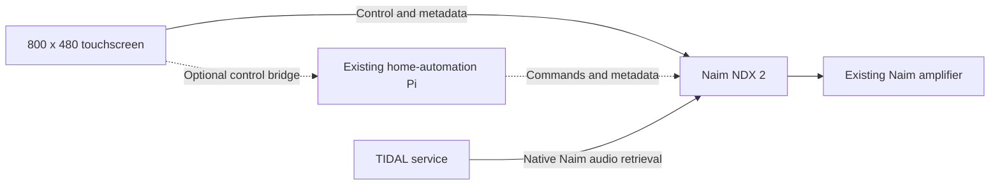

# Architecture

## Required playback path

This is the intended architecture. The solid local control path was exercised from a computer; neither ESP32 firmware nor a Pi bridge has been implemented. Network packets to TIDAL were not independently captured, but the live native endpoint, native queue class and player source identified the Naim TIDAL path. The test process fetched no audio.

## Responsibilities

**Controller:** rendering, touch input, local UI state, cached artwork, sleep/wake policy and battery monitoring. It sends high-level requests and rechecks actual device state after reconnecting.

**NDX 2:** native music retrieval and decoding, native queue and playback state. Existing amplifier integration must be preserved.

**Optional Pi:** convenience layer for search, artwork conversion, caching or reconnect handling. Its necessity is still under evaluation: direct Naim browsing has worked without it. Home Assistant's web page is reachable; no authenticated HA integration has been inspected or installed.

## Observed local interface

The tested NDX 2 exposes HTTP port 15081, API 1.4.0 and appVer 3.11.0.5662. Firmware changes could affect behaviour.

| Operation | Observed request or reference |
| --- | --- |
| System information | `GET /system` |
| Input descriptions | `GET /inputs` |
| Current playback | `GET /nowplaying` |
| Native queue | `GET /inputs/playqueue` |
| Favourites | `GET /favourites` |
| Native content | Returned `inputs/tidal/artists/...`, `albums/...`, `playlists/...`, `tracks/...` references |
| Single native track playback | `GET /inputs/tidal/tracks/{returned-id}?cmd=play` |
| Stop request | `GET /nowplaying?cmd=stop` |

Some GET requests mutate playback. HTTP method alone is not a read-only guarantee. The diagnostic tool uses a fixed command-free allowlist.

Native playback reports `source=inputs/playqueue`, `sourceDetail=tidal`; the queue item class was `object.track.tidal`. Merely seeing playqueue is not enough to identify the music source.

Do not assume every duration uses the same units: the track description returned seconds, while now-playing duration and advancing position appeared in milliseconds. Negative position occurred during startup. Production parsing needs explicit per-field handling and tests.

## Extensibility

Separate UI requests from service adapters and Naim player commands. Future providers must satisfy the same native-playback requirement. Avoid building a universal audio server as a shortcut. Native queue edits and wired System Automation amplifier control have passed live tests. Search uses the project’s public TIDAL catalogue adapter. Native search syntax is not required by this prototype; long-running authentication renewal and recovery remain deployment validation work.

## Catalogue metadata prototype

The computer-side UI uses a loopback-only Python bridge in tools/prototype_ui.py. It runs a labelled demo by default; optional live catalogue and NDX configuration use the existing adapters. This is an implementation aid for the chosen display, not a committed Pi deployment or ESP32 firmware architecture. See [prototype scope and validation](prototype-ui.md).

tools/tidal_catalog.py implements public TIDAL catalogue search separately from native Naim playback. It uses this project's own developer credentials, sends only metadata requests, and returns candidate native IDs for subsequent resolution on the NDX. It does not import Naim credentials, fetch playback manifests or transfer audio. Credentials and tokens stay in the computer/Pi process; deployment on the final controller is undecided. Live search and pagination pass for artists, tracks, albums and playlists. Public search → native track resolution → playback has passed through the UI. AI discovery supplies catalogue queries only; see [voice discovery](voice-discovery.md).

## Account collection and phase boundary

The prototype also uses the project’s own TIDAL OAuth authorization for collection read/write, with exact album/artist metadata links and native resolution before playback. See [collection integration](tidal-library.md). The computer bridge is a proven reference implementation, not a selected final deployment. Software feasibility is closed; [the handover](milestone-handover.md) governs detailed design and records the remaining reliability and hardware gates.
