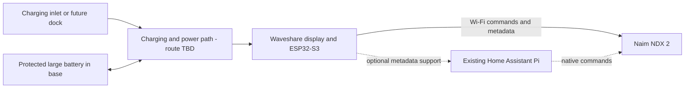

# Hardware design

Revision 0.1 — 20 September 2026. Proposal; not a wiring-ready schematic.

## Preferred display assembly — HW-001

| Property | Record |
| --- | --- |
| Manufacturer / exact model | Waveshare ESP32-S3-Touch-LCD-4.3B |
| Variant | Standard, without case; SKU 27848 |
| Selection | Preferred by user; awaiting prototype validation |
| Display | 4.3-inch IPS LCD, 800 x 480, capacitive touch |
| Computing | Integrated ESP32-S3, 16 MB flash, 8 MB PSRAM; no separate MCU or Wi-Fi board required |
| Mechanical reference | Manufacturer board outline 112.4 x 75.1 mm; connector protrusions, depth, mounting and cable bends still to measure |
| Cost reference | USD 36.99 without case, checked 20 September 2026; excludes shipping and tax |
| Supply | Documented USB-C 5 V input, 7–36 V DC input and separate 3.7 V single-cell lithium battery connection |
| Battery connector | MX1.25; confirm pin count, polarity and actual board revision before specifying the harness |
| Consumption reference | Manufacturer lists 5 V / 450 mA; not our measured workload or a standby figure |
| Firmware | ESP-IDF / Arduino and LVGL examples; our Naim firmware has not been demonstrated |

Sources: [product and price](https://www.waveshare.com/product/arduino/boards-kits/esp32-s3/esp32-s3-touch-lcd-4.3b.htm), [hardware documentation](https://docs.waveshare.com/ESP32-S3-Touch-LCD-4.3B), [legacy wiki and schematic links](https://www.waveshare.com/wiki/ESP32-S3-Touch-LCD-4.3B). Manufacturer specifications are reference evidence, not bench validation. Do not substitute the 4, 4B, plain 4.3 or P4 models without review.

## Functional architecture

The power block can be onboard or external; it does not imply a separate charger purchase. Naim and Pi power remain outside the handheld battery system.

## Power routes to evaluate

| Route | Advantages | Open checks |
| --- | --- | --- |
| A: protected 1S pack to documented Waveshare battery input, charging through board | Fewest extra boards; uses integrated power system | Exact schematic/revision, pack chemistry/voltage, polarity, charge current, load sharing, low-voltage shutdown, whole-board sleep |
| B: protected 1S pack with separate charger/power path and regulated 5 V into board USB-C supply | Allows independent power sizing and charge-rate choice | Converter idle current, peak current, true shutdown, USB power routing, touch wake and extra volume/cost |
| C: regulated USB battery pack for bench comparison | Quick removable power source | Low-load auto-off, restart behaviour, pass-through charging and sleep consumption; not selected for final build |

Start by assessing A; choose B only if the measurements or charging requirements justify it. Never connect the pack to the 7–36 V input as though it were the battery connector. If using B, isolate the unused onboard battery/charging path according to a verified schematic. No dual-charger connection is approved.

## Physical arrangement

Proposed upper assembly: display supported by its board/mounting structure, with recessed perimeter protection; no clamping load on active glass.
Proposed lower assembly: removable protected battery cradle, accessible power electronics and strain-relieved wiring.
Proposed finish: charcoal, softly rounded edges, shallow tilt and non-slip silicone base.
Keep Wi-Fi antenna clearance away from battery, wiring and any added ballast; follow the module's antenna guidance at CAD stage.
Use a removable underside and reusable fasteners. Exact wall thickness, tilt, screw sizes and insert lengths follow component measurements.
Use the display's existing touch cover initially; an additional overlay is optional and requires optical/touch testing.
Add separate ballast only after the battery/build mass and stability are measured.
No speaker, DAC, audio amplifier or local audio transport is required.

## Expected operating states

- Active: screen lit, Wi-Fi connected, catalogue browsing and commands.
- Connected idle: optional short interval before sleep; consumes more than deep sleep.
- Standby: backlight off, lowest viable electronics state with validated touch wake. Reconnect and retrieve fresh Naim state after wake.
- Storage off: physical disconnect/service mode; touch wake need not operate in this state.

Idle screen timeout, wake latency target, daily interaction time, desired listening-time display behaviour and recharge interval remain user-profile decisions. See [research](research.md) and [validation](validation.md).
