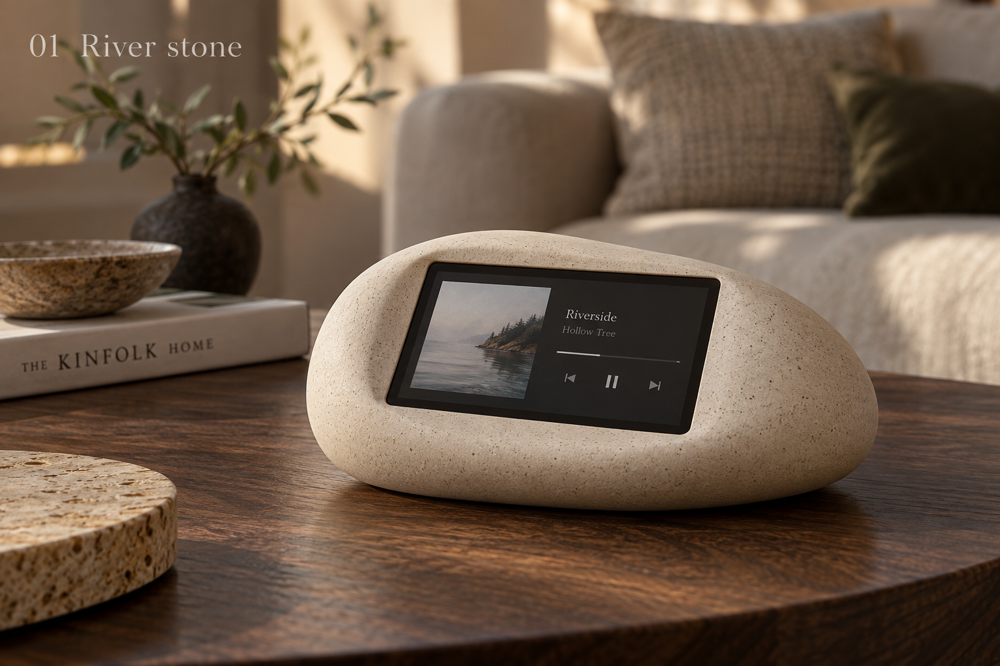
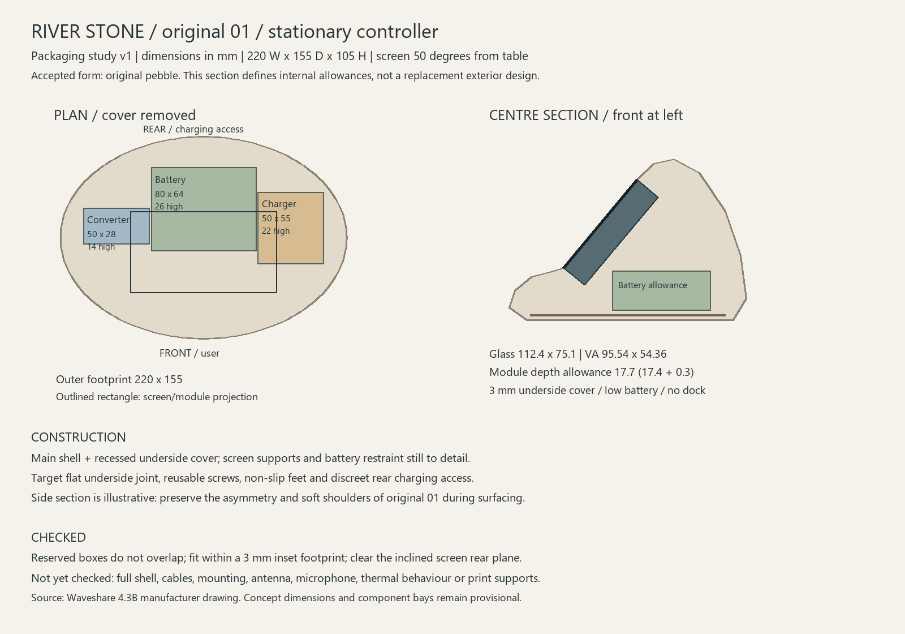

# Original 01 River Stone: stationary enclosure

Status: dimensioned packaging study, 20 September 2026. Original visual concept selected by the user; stays on the coffee table. Dimensions and construction details below are engineering proposals, not user-approved measurements or manufacturing release.

**Latest revision:** [v3 reinforced shell, matching cover and screen-edge bevel](shell-v3/README.md). Full-shell print release remains pending.

**Shell baseline, 21 September 2026:** see the [shell and assembly study](shell-v1/README.md) for actual solids, revised component positions and insertion clearance. The plan-view study below is retained as its starting point.

Preserve the original's low asymmetric pebble, soft shoulders, inset landscape screen and mineral surface. The four later variations and Crescent embrace are superseded. Do not evolve this into an exposed monitor stand or stacked removable controller.

## Architecture and simplicity

One stationary controller, one battery, one main shell and one recessed underside cover. No separate handheld battery, angle rails, docking magnets, transmitter/receiver or controller-to-base charge transfer. Rear cable charging is the working proposal; ordinary operation remains cable-free. This does not select a charger or wiring scheme. Existing external charger/power-path research remains applicable.

The P1S and 0.4 mm nozzle are the user's home manufacturing constraint. Prefer a filament surface that is acceptable directly from the printer. Fine stone-effect speckling is a visual direction, not a selected filament. Material compatibility, nozzle requirements and sample finish must be checked for the exact product; no assumption that all mineral-filled filaments suit the stock nozzle. Acetone smoothing and painting are not requirements.

## Dimensioned layout

[Vector drawing](layout.svg) · [Numerical checks](clearance-checks.json) · [Generator](../../../tools/river_stone_layout.py)

| Item | Working allowance |
|---|---|
| Overall body | 220 W x 155 D x 105 H mm; bounding envelope, not an optimized minimum |
| Screen | 50 degrees from table, lower lens edge 34 mm above underside datum |
| Lens | 112.4 x 75.1 mm; supplier tolerance +/-0.1 mm each |
| Visible area | 95.54 x 54.36 mm; supplier tolerance +/-0.15 mm each |
| Screen module depth | 17.7 mm allowance includes drawing's 17.4 +/-0.3 mm; excludes plugged cables |
| Battery space | 80 x 64 x 26 mm, starting 6 mm above underside |
| Charger space | 50 x 55 x 22 mm, rotated planning allowance |
| Converter space | 50 x 28 x 14 mm |
| Shell / cover | Start with 3 mm nominal; final shell offset, ribs, joints and inserts unresolved |

Coordinates in the generator: X left/right, Y positive rear, Z positive up; underside datum Z=0. Bay sizes are installation reservations, not supplier dimensions. Battery reference is the earlier 69 x 54 x 18 mm protected pack candidate; it is not purchased or electrically approved. A rectangular reservation must not be mistaken for an actual serviceable cavity.

The screen's 800 x 480 pixel canvas is not its physical aspect ratio. Use the manufacturer's VA dimensions for physical visualizations. Source: [Waveshare drawing archive](https://files.waveshare.com/wiki/ESP32-S3-Touch-LCD-4.3B/ESP32-S3-Touch-LCD-4in3B_Drawing.zip). The drawing was downloaded and visually inspected; the local original source is retained with the design-session artifacts. No mounting-hole or cable-clearance release is inferred from these measurements.

## What the checks establish

The three rectangular reservations are mutually disjoint, fit inside an ellipse with each semi-axis reduced by 3 mm, and lie below the infinite rear plane of the inclined screen module. This ellipse is a footprint approximation, **not a true constant-thickness offset of a final shell**. Normal gaps to the screen rear plane are battery 8.10 mm, charger 3.01 mm and converter 19.64 mm. The charger gap is the tightest: mounts, cable routes and tolerances may require moving it or increasing the envelope.

The side section is an illustrative centre profile. It is not the exterior CAD surface; the original image governs the asymmetric shoulders. Full shell clearance, fasteners, cable plugs/bends, antenna clearance, microphone hardware, touch force stability and heat are unverified. Do not print this drawing as a fabrication template or buy components based on it.

## Assembly proposal

1. Print the main shell and removable underside separately. Start evaluating the shell with its underside opening toward the bed; flatten the hidden joint rather than supporting a rounded underside. Screen aperture edges and upper internal surfaces still need a slicer overhang check. A no-support claim is premature.
2. Insert the screen from below through the open underside. Use discrete internal mounting supports and a compliant perimeter gasket; no concentrated fastener load on the glass. Retainer geometry and insertion sweep follow actual board mounting details.
3. Fit an insulated removable battery restraint and the two power boards to the underside assembly. Allow a service loop so the cover can open without pulling connectors. Do not compress the pack. Keep antenna clearance and optional microphone placement out of the battery/ballast region.
4. Close using reusable screws into designed bosses/inserts. An initial four-screw concept is reasonable, but coordinates and lengths must follow the interior layout. Put non-slip feet where they do not conceal required service screws.
5. Provide a discreet rear inlet and strain relief appropriate to the eventual power path. Preserve programming access. A slot or port cut-out is not released until the chosen connector, plug and cable bend are modelled.

## Next engineering work, without another concept-selection gate

- Build the asymmetric shell surface to the original reference, using these reservations as keep-outs. Assess whether the 105 mm high rear can be lowered while retaining the screen angle and access.
- Incorporate the manufacturer's STEP and measured connector/mount information; perform a real shell offset and insertion-path check before a fit STL.
- Resolve charger placement with its actual board outline and wiring; maintain the existing power research limits. Battery current and runtime require bench evidence.
- Reserve microphone hardware consistent with the accepted voice feature; do not silently omit it or claim its volume is already proven.
- Slice a partial bezel/mount sample before committing to the full decorative shell, then test viewing and touch on the actual table.

The only later user input likely to matter is actual seated usability or a choice between credible finish samples. This study does not require another aesthetic confirmation.
