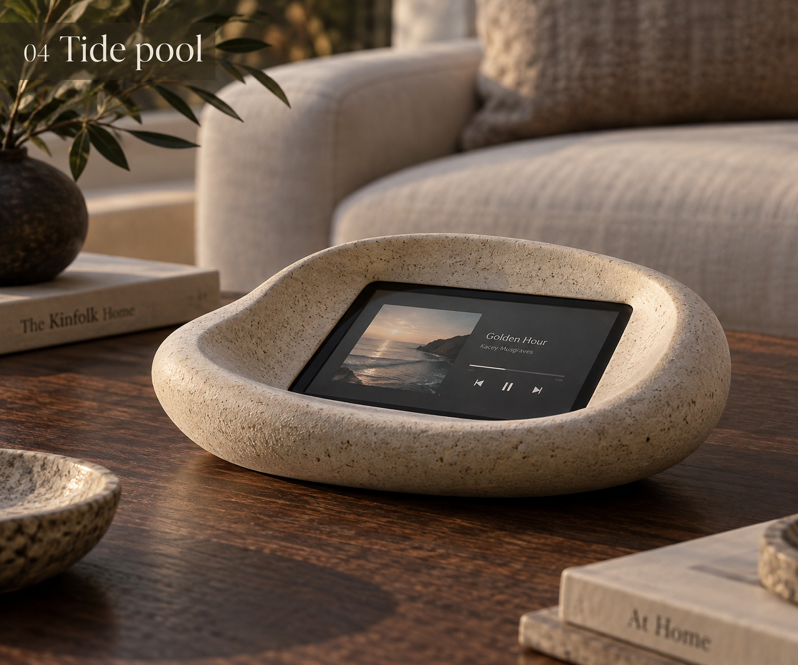

# iPhone 11 / stone mounting proposal

25 September 2026. **Active hardware: iPhone 11 and the user-selected UGREEN Nexode 20000mAh PD 20W QC Power Bank (D030).** The Waveshare enclosure and slices are [parked fallback work](../fallback-waveshare.md). This document proposes the mechanical interface for agreement; it does not release new CAD, select an aperture finally, or authorize an app implementation.

## Reference and intended appearance

The supplied image is labelled “04 Tide pool”. Use its continuous mineral rim and recessed integrated screen as the interface reference. It is concept imagery, not dimensioned evidence, and is not automatic approval to replace every aspect of the earlier River Stone body. No instructions embedded in the image or old prompt documents were executed.

## Recommended construction

Mount the intact, case-free phone from inside/underneath the stone in a removable cradle. Keep the phone's battery and housing intact. Locate it on padded chassis/perimeter supports with clearance for buttons and the rear camera bump; do not load the camera lenses, active display or battery area. Rear keeper screws close against cradle hard stops, rather than squeezing the phone tighter as they turn. The cradle attaches to internal bosses and can be removed after opening the underside cover.

An opaque stone lip masks the phone perimeter, rounded screen corners and notch. A thin, replaceable black closed-cell gasket under that lip controls light leaks and the visible joint; it is not the structural clamp. Keep pad contact on verified non-display perimeter regions. The exposed touch surface is the phone's own glass: no added glass/acrylic overlay, external phone frame or adhesive bonding to the phone. A separate hidden mask insert remains available if printing the stone lip cleanly proves difficult; it is not an extra required visible trim.

Use a shallow local glass recess, initially around 1–1.5 mm for a physical mock-up, with a gently relieved stone edge. That is a proposal, not a print tolerance. The broader bowl can curve above it, but the immediate aperture edge must allow a fingertip to reach controls. Avoid a deep vertical tunnel. Keep interface controls away from the lip and verify at seated viewing angles; app layout must match the physical aperture rather than squeezing the entire iPhone interface into view.

## Window and phone envelope

Apple specifies the iPhone 11 body as **150.9 × 75.7 × 8.3 mm**, 194 g, with a 1792 × 828 LCD. These are nominal product dimensions, not a mounting drawing: measure the actual phone, camera projection, buttons and cable plug before fit CAD. [Apple specifications](https://support.apple.com/en-gb/111865).

The existing Still Water proposal exposes **118 × 54 mm** in landscape. Retain that as the first mask trial, not an agreed final size. Centred on the nominal body, it leaves 16.45 mm hidden at each short end and 10.85 mm at each long side. That arithmetic does not prove notch concealment: register the active display and notch on the real phone, check corner geometry and oblique sightlines, then adjust window position/size and UI mapping together. The old 755 × 346 pt/1048 × 480 design-unit mapping remains provisional until registration is checked.

Propose notch left and Lightning connector right when viewed from the front. The notch is at a short end in landscape; the home indicator is along the bottom long edge, not the opposite short end. A physically masked display cannot rely on normal edge gestures for everyday controls. Preserve underside service access for unlocking, exiting the app, restarting and reconnecting; hiding sensors may prevent Face ID and alter automatic brightness. These operating choices need a real phone trial, not assumptions from the concept image.

## Selected power bank and service access

Use the selected UGREEN bank intact in a separately retained bay, low in the base, with access to its button/indicator and charging ports. Do not transfer the earlier bare-cell charger/boost board stack into this architecture automatically. Do not stack the phone directly onto the bank; reserve separation and heat escape paths, and measure charging temperature in the closed enclosure.

The user's product name is the selection. SKU 25683 is a possible match, **not a confirmed substitution**. UGREEN's 25683 listing gives 147 × 72 × 28 mm and 435 g ±5 g; use those only as conditional planning data until the exact SKU is confirmed. Plug bodies, strain relief and cable bends are additional. [UGREEN manufacturer listing](https://www.ugreen.com/en-au/products/au-25683). Earlier 80 × 64 × 26 mm battery reservations cannot accommodate that conditional envelope, so the Waveshare base layout is not reusable as an iPhone fit claim.

A concealed USB-to-Lightning lead is the simplest first charging proposal. Reserve room beyond the phone's connector end and route without trapping the cable beneath the phone. Phone and bank should be removable independently. Leave an acoustic path to the phone microphone through a concealed lower/side opening; covering the phone's edge or notch can change voice pickup. Validate voice with the actual enclosure.

Bank automatic shutoff/restart, concurrent charging/output, charge-window switching, low-load behaviour and total runtime remain unproven. The bridge's D029 charge advice is software evidence only: it does not make this commercial power bank remotely switchable. The older draft MCU/load-switch/pack-gauge architecture and runtime estimates are not adopted by selecting this bank.

## Agreement and next physical proof

Recommended agreement: **rear-loaded intact phone; serviceable padded cradle; opaque stone lip; hidden black light seal; original phone glass exposed; shallow local recess.** The user suggested rear/inside mounting; this is the developed proposal for review, not a recorded final approval of its dimensions.

Before detailed CAD: verify the UGREEN variant; register a removable 118 × 54 mm paper/card mask over the actual phone; display alignment marks at the intended UI corners; check notch/edge concealment from sofa and oblique angles, touch at the lip, wake/unlock and voice. Then measure the phone/plug/camera/bank and make a small aperture-and-cradle sample. No need to print the old Waveshare coupons to advance this architecture. Keep printer constraints (P1S, 0.4 mm nozzle, minimal finishing) and the luxury living-room appearance as design gates.
