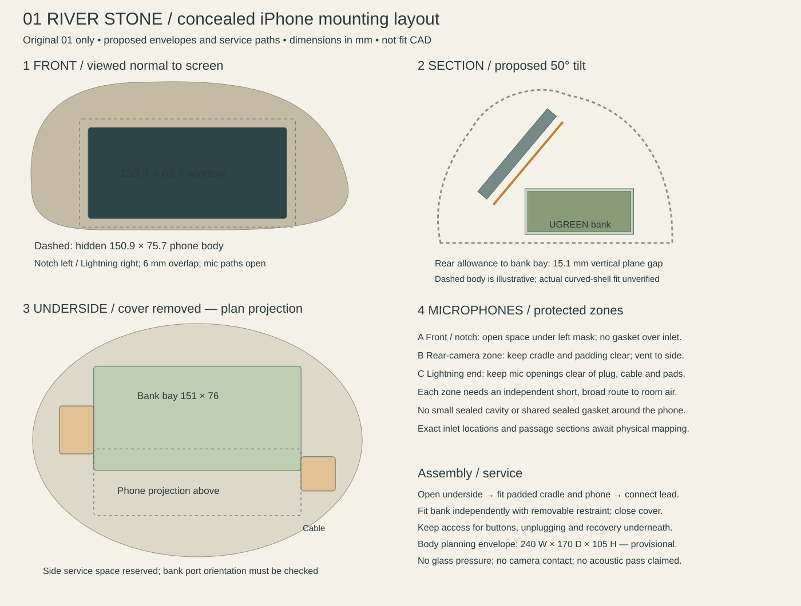
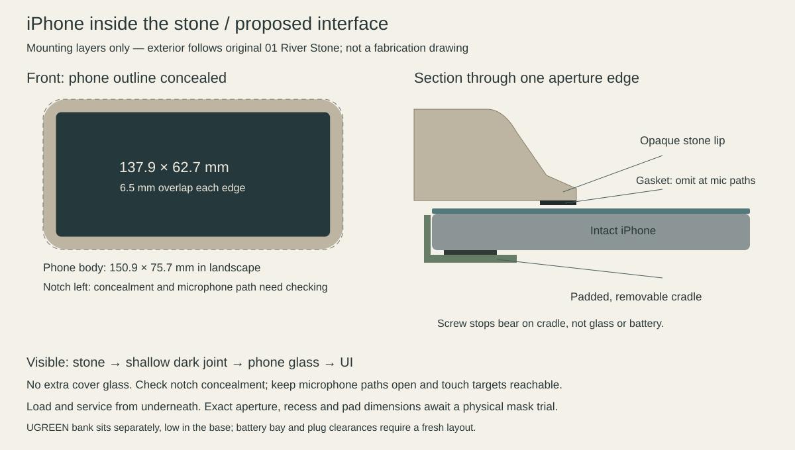

# iPhone 11 / stone mounting proposal

25 September 2026. **Active hardware: iPhone 11 and the user-selected UGREEN Nexode 20000mAh PD 20W QC Power Bank (D030).** The Waveshare enclosure and slices are [parked fallback work](../fallback-waveshare.md). This document proposes the mechanical interface for agreement; it records the accepted paper aperture but does not release fit CAD or authorize an app implementation.

## Reference and intended appearance

**User clarification, 25 September 2026: original 01 River Stone is the sole visual reference for both the body and screen-to-stone interface.** Preserve its low asymmetric pebble, soft shoulders, inset landscape screen and mineral finish while adapting the internals for iPhone 11 and the selected UGREEN bank. The supplied “04 Tide pool” image is retained only as superseded reference history; do not use its bowl/rim geometry to drive the design. The section diagram below explains mounting layers only and does not prescribe the exterior contour.

## Mounting layout — revised 27 September 2026

[Layout checks](layout-checks.json) · [1:1 paper aperture template](mask-trial.svg) · [Reproducible layout generator](../../../../tools/iphone_mount_layout.py)

The user repeated the selected bank name, UGREEN Nexode 20000mAh PD 20W QC Power Bank, and authorized proceeding. Use the matching manufacturer's 147 × 72 × 28 mm envelope to progress the layout; the exact physical unit and port arrangement still require checking before a fitted cradle. This is a working assumption, not a substitution of another power bank or a request to reopen the selection.

| Proposal | Working value |
|---|---|
| Overall planning bounds | 240 W × 170 D × 105 H mm |
| Phone angle | 50 degrees from the table |
| Lower phone glass edge | 36 mm above underside datum |
| Visible aperture | 138.9 × 63.7 mm bounds; size passed by user; 6 mm inset from every outer phone edge |
| Aperture corner radius | R3 mm all four corners; user passed the rounded aperture trial |
| Local glass recess | 1.2 mm trial target |
| Bank bay | 151 × 76 × 32 mm, around the 147 × 72 × 28 envelope |
| Rear-of-phone reserve | 6 mm beyond nominal phone body, not a measured camera dimension |
| Phone connector / bank service reservations | 25 mm each at opposite sides; actual plugs and bend radius unmeasured |

The bank sits across the base, low and behind the inclined phone. Coordinates and exact reservations are in the JSON. The bank bay clears the conservative infinite phone-rear allowance plane by **15.08 mm vertically** at its closest corner. This is only an analytical plane/box check. It does not establish curved-shell clearance, fitting tolerances, vent dimensions, screw access, insertion or temperature. Body dimensions and tilt are engineering proposals; they are not dimensions recovered from the original concept image. Revisit them after the mask and hardware measurements.

Use a cradle with open front-notch, rear-camera and connector-end zones. Avoid a full clamshell around the phone. Keep long-edge buttons free; place padded chassis supports only after mapping the actual button and microphone positions. Interrupt the light-seal gasket around the front acoustic inlet and preserve an open route beneath an optically concealing lip. Reserve a separate rear-camera acoustic route and keep the Lightning-end openings clear of cable plugs and restraints. Vents must open to room air above the table contact plane, not into a sealed bank cavity. The sketch shows protected zones, not verified inlet coordinates or finished ducts. Exact port mapping and mounted recordings are mandatory before claiming unobstructed microphone performance.

Assembly proposal: phone into cradle, cradle into open stone, connect lead, then fit the separately restrained bank and underside cover. The projected volumes overlap, so assume the bank must come out first for phone removal; independent phone removal with the bank installed is not proven. No load-bearing back clamp over the phone battery, and no lens contact.

Print the paper template at 100% and verify its 50 mm scale. Cut the window and hold the mask over the phone without sticking it across the earpiece or any microphone opening. Check notch/edge concealment, oblique views and touch reach; remove the paper for unmounted voice baselines. The next 3D sample should reproduce the aperture edge and interrupted gasket/acoustic passage, not just a decorative frame. Compare Voice Memos and front/rear camera recordings, then the intended voice app, at the same distance/orientation before and after mounting. Apple provides separate microphone checks for [voice recordings and both camera directions](https://support.apple.com/en-gb/101600). This is a test plan; nothing has been physically recorded or printed here.

## Recommended construction

Mount the intact, case-free phone from inside/underneath the stone in a removable cradle. Keep the phone's battery and housing intact. Locate it on padded chassis/perimeter supports with clearance for buttons and the rear camera bump; do not load the camera lenses, active display or battery area. Rear keeper screws close against cradle hard stops, rather than squeezing the phone tighter as they turn. The cradle attaches to internal bosses and can be removed after opening the underside cover.

An opaque stone lip conceals the phone perimeter; notch and corner concealment must be checked with the enlarged opening. A thin, replaceable black closed-cell gasket under that lip controls light leaks and the visible joint; it is not the structural clamp. Keep pad contact on verified non-display perimeter regions. The exposed touch surface is the phone's own glass: no added glass/acrylic overlay, external phone frame or adhesive bonding to the phone. A separate hidden mask insert remains available if printing the stone lip cleanly proves difficult; it is not an extra required visible trim.

Use a shallow local glass recess, initially around 1–1.5 mm for a physical mock-up, with a gently relieved stone edge. That is a proposal, not a print tolerance. The surrounding pebble surface follows original 01 River Stone; the immediate aperture edge must allow a fingertip to reach controls. Avoid a deep vertical tunnel. Keep interface controls away from the lip and verify at seated viewing angles; app layout must match the physical aperture rather than squeezing the entire iPhone interface into view.

## Window and phone envelope

Apple specifies the iPhone 11 body as **150.9 × 75.7 × 8.3 mm**, 194 g, with a 1792 × 828 LCD. These are nominal product dimensions, not a mounting drawing: measure the actual phone, camera projection, buttons and cable plug before fit CAD. [Apple specifications](https://support.apple.com/en-gb/111865).

**26 September revision:** the user rejected the 118 × 54 mm opening as too small and subsequently reduced the proposed overlap to **6 mm measured inward from the outer phone edge**. Apply this to all four edges as the next trial baseline: (150.9 − 12) × (75.7 − 12) = **138.9 × 63.7 mm**, centred on the phone body. This is approximately **38.9% more rectangular opening area**, not a claim about active pixel area. The width and height subsequently passed the user’s physical trial; R3 corner geometry also passed on 27 September; any local microphone relief remains to be verified.

Maximise display exposure within this baseline. A uniform overlap does not prove that the notch is hidden or that the front microphone is clear. Check registration on the actual phone; use local lip relief and an interrupted gasket wherever needed to leave the inlet and a short, broad path to room air open. Do not shrink the whole aperture again merely to hide the notch. Exact relief dimensions await microphone mapping; the rounded paper template is a visual registration aid only. The earlier 755 × 346 pt/1048 × 480 design-unit mapping is superseded for this aperture and must be recalculated from actual screen registration before UI work.

Propose notch left and Lightning connector right when viewed from the front. The notch is at a short end in landscape; the home indicator is along the bottom long edge, not the opposite short end. A physically masked display cannot rely on normal edge gestures for everyday controls. Preserve underside service access for unlocking, exiting the app, restarting and reconnecting; hiding sensors may prevent Face ID and alter automatic brightness. These operating choices need a real phone trial, not assumptions from the concept image.

## Selected power bank and service access

Use the selected UGREEN bank intact in a separately retained bay, low in the base, with access to its button/indicator and charging ports. Do not transfer the earlier bare-cell charger/boost board stack into this architecture automatically. Do not stack the phone directly onto the bank; reserve separation and heat escape paths, and measure charging temperature in the closed enclosure.

The user's product name is the selection. SKU 25683 is a possible match, **not a confirmed substitution**. UGREEN's 25683 listing gives 147 × 72 × 28 mm and 435 g ±5 g; use those only as conditional planning data until the exact SKU is confirmed. Plug bodies, strain relief and cable bends are additional. [UGREEN manufacturer listing](https://www.ugreen.com/en-au/products/au-25683). Earlier 80 × 64 × 26 mm battery reservations cannot accommodate that conditional envelope, so the Waveshare base layout is not reusable as an iPhone fit claim.

A concealed USB-to-Lightning lead is the simplest first charging proposal. Reserve room beyond the phone's connector end and route without trapping the cable beneath the phone. Phone and bank should be removable independently. **Firm user constraint: mounting must not obstruct the iPhone microphones.** Map the actual microphone openings before fixing the cradle, gasket or masking lip; preserve their acoustic paths, including around the connector end. Provide concealed acoustic openings where the stone would otherwise enclose them. Revise the masking rather than sacrifice microphone access. Validate voice pickup in the assembled enclosure; no acoustic performance is claimed yet.

Bank automatic shutoff/restart, concurrent charging/output, charge-window switching, low-load behaviour and total runtime remain unproven. The bridge's D029 charge advice is software evidence only: it does not make this commercial power bank remotely switchable. The older draft MCU/load-switch/pack-gauge architecture and runtime estimates are not adopted by selecting this bank.

## Accepted paper aperture — 27 September 2026

The user passed the window size and subsequently passed the R3 corner revision. The accepted aperture baseline is **138.9 × 63.7 mm, 6 mm overlap from each outer phone edge, and R3 mm circular corners on all four corners**. Preserve these dimensions in subsequent mounting CAD. The radius is in the opening plane; it does not specify a bevel or fillet through the lip thickness. This records the user's paper-template fit result, not independent measurement of the iPhone screen radius.

Next develop the small aperture-and-cradle sample around this accepted opening. Recess, edge touch access, retention, exact microphone passages and mounted acoustic performance remain unverified. Preserve open microphone paths and interrupted gasket.

## Agreement and next physical proof

Recommended agreement: **rear-loaded intact phone; serviceable padded cradle; opaque stone lip; hidden black light seal; original phone glass exposed; shallow local recess.** The user suggested rear/inside mounting; the aperture dimensions above are accepted; cradle and recess dimensions remain proposals.

Before detailed CAD: verify the UGREEN variant; register a removable 138.9 × 63.7 mm paper/card mask with 6 mm overlap on each edge over the actual phone; display alignment marks at the intended UI corners; check notch/edge concealment from sofa and oblique angles, touch at the lip, wake/unlock and voice. Then measure the phone/plug/camera/bank and make a small aperture-and-cradle sample. No need to print the old Waveshare coupons to advance this architecture. Keep printer constraints (P1S, 0.4 mm nozzle, minimal finishing) and the luxury living-room appearance as design gates.
