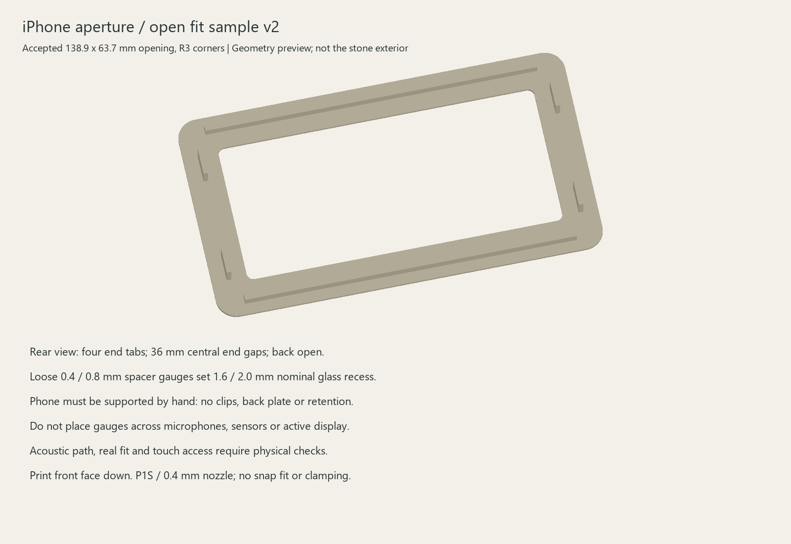

# iPhone aperture fit sample v2

28 September 2026. Open, hand-supported sample for the accepted **138.9 × 63.7 mm / R3 aperture with 6 mm overlap**. Original 01 River Stone remains the exterior reference; this test fixture does not define the stone silhouette.

## Files and printing

- [Frame STL](aperture-frame.stl) / [STEP](aperture-frame.step).
- [0.4 mm spacer gauge](spacer-0.4mm.stl) and [0.8 mm spacer gauge](spacer-0.8mm.stl). Duplicate four of the chosen thickness in the slicer. Do not mix thicknesses.
- [Solid checks](validation.json) / [STL checks](mesh-validation.json).

P1S with 0.4 mm nozzle. Trial starting point: familiar plain PLA, 0.2 mm layers, three walls, front face flat on the bed as exported. Use the normal profile for the actual filament and plate. Inspect sliced layers and spacer adhesion. No slice, time estimate or G-code is validated here.

Frame: 170 × 95 × 9.2 mm. Lip: 1.2 mm. Four end-locating tabs added; back remains open. Two long-edge stiffeners have a 79 mm inner gap versus nominal 75.7 mm phone width. The existing long rails remain unchanged. End tabs are 2 mm thick × 12 mm long × 8 mm high above the lip, with inner faces 152.9 mm apart: 1 mm nominal clearance at each end of the 150.9 mm body. Two tabs per end leave a 36 mm central opening above the lip. These are deliberately loose locators, with no snap-fit, overhang or back clamp. Exact button, microphone and camera clearance is not verified. Geometry is designed to grow from the flat flange without unsupported overhangs.

## Trial

1. Inspect for burrs, flatness and dimensional error before bringing the print near glass. Do not force the phone between rails.
2. Support the phone by hand from behind: **there is no retention**. Keep the rear camera, microphones, connector and buttons clear; do not rest the rear camera on a worktop.
3. Centre the accepted paper mask to register the opening. Select four spacer positions on the actual non-display perimeter, away from microphones, sensors and buttons. Positions are deliberately not fixed in CAD. Do not place gauges on active pixels. If safe positions cannot be established, hold the frame clear and report that before adding retention.
4. Compare 0.4 mm spacers (1.6 mm nominal glass recess including the lip) and 0.8 mm spacers (2.0 mm recess). Added protective film or padding increases the gap. Final recess remains unselected.
5. Check corner concealment, alignment, edge touch access and seated/oblique views. Keep cable plugs clear of microphone openings.
6. Check straight rear insertion/removal and record side-to-side movement. The nominal free movement is 2 mm along the phone length and 3.3 mm along its width; keep the phone centred for aperture assessment. Confirm each tab clears the real hardware, not just the nominal body. The central gaps reserve access but are not measured microphone keep-outs.
7. Compare bare-phone and sample-mounted voice recordings at the same orientation and distance using the intended app and existing Voice Memos/front/rear camera checks. Do not add continuous gasket or tape across inlets. An open back or narrow gap alone does not prove an unobstructed acoustic path.

Production retention, screw stops, padded supports and acoustic passages follow actual hardware mapping. This sample tests aperture/lip access and rear-loading space; it is not a finished cradle and does not validate the eventual closed stone's acoustics.

## Verification

Three valid CAD solids; zero intersection between accepted aperture cutter and frame. The nominal body box at the shallowest spacer setting does not intersect the frame. Both 36 mm central end channels are clear above the lip. These checks exclude protruding buttons/camera, cable plug and acoustic performance. All three STL meshes are watertight, consistently wound, single-component and fit within 256 mm. Preview comes from actual CAD tessellation. No physical printing or voice test claimed.

Reproduce with tools/iphone_mount_sample.py --deps followed by the CadQuery dependency directory; tools/check_iphone_mount_sample.py --deps followed by the trimesh directory; and tools/render_iphone_mount_sample.py. Python 3.12 with CadQuery 2.8, NumPy/Pillow and trimesh was used. Pass --revision v2 to all three tools (the current default); --revision v1 reproduces the earlier sample.

## Revision scope

User authorized short locating tabs at both ends to obtain more fit data in one print. Aperture, corner radius, flange, long rails and spacers are unchanged. The original [v1 sample](../sample-v1/README.md) is preserved. Use v2 for the next print; the two spacer meshes are identical to v1 and need not be reprinted if already available. This fixture still requires hand support and does not lock the phone in place.
