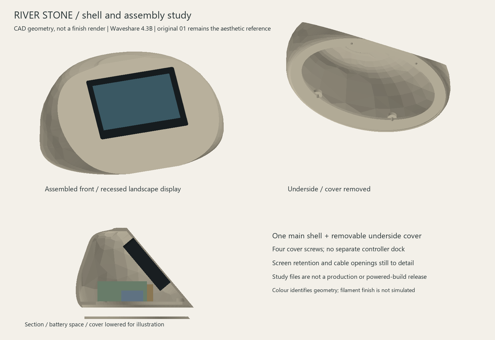

# River Stone shell and assembly study v1

> **PARKED FALLBACK — 25 September 2026 (D030).** This is Waveshare-specific work, preserved without changing its geometry/results. Active design is [iPhone 11 mounting](../iphone-mount/README.md); old printing/next-step instructions below are suspended. See [fallback status](../fallback-waveshare.md).

21 September 2026. **Dedicated Waveshare 4.3B, without case (D017); original 01 River Stone, stationary (D014).** Engineering study, not a production housing or a release for powered assembly.



This develops the selected original pebble into a hollow shell, recessed screen opening, underside cover, four cover-fastener locations and internal component reservations. The preview is rendered from the CAD tessellation. It does not simulate a filament finish. Compare the exterior with [original 01](../original-01.png); the shell surface remains a first interpretation, especially the crown and screen-facet transition.

## Files

- [Shell STEP](shell-study.step) and [cover STEP](cover-study.step): editable boundary-representation solids.
- [Assembly STEP](assembly-envelopes.step): shell, cover, conservative display envelope and component reservations. Reservation blocks are not actual electronics models.
- `shell-study.stl`, `cover-study.stl`, `module-envelope.stl`: millimetre meshes in assembly coordinates for inspection, not pre-sliced print jobs.
- [Validation record](validation.json): exact current bounds, clearances, modelling settings and limitations.
- [Supplier registration preview](supplier-registration.png): imported manufacturer model, inspected separately from the conservative fit envelope.
- [CAD generator](../../../../tools/river_stone_shell.py) and [preview renderer](../../../../tools/render_river_stone.py).

## Construction developed

The exported shell mesh measures approximately **220.1 x 152.4 x 103.0 mm**. The underside cover is approximately **201.4 x 136.4 x 3.0 mm**; its front edge is clipped to the enclosure slope. These are geometry bounds, not shrinkage-compensated finished-part dimensions.

The display remains at 50 degrees from the table. Its front lens sits 1.8 mm behind the nominal facet: a 1 mm perimeter lip plus 0.8 mm provisional gasket allowance. The front opening is 109.4 x 72.1 mm, with 2.5 mm corner radii; the hidden pocket is 113.2 x 75.9 mm with clearance at its corners. The lens dimensions are 112.4 x 75.1 mm. The visible area is 95.54 x 54.36 mm, positioned from the supplier drawing, not inferred from pixel aspect ratio. No second touch overlay is proposed.

The cover is 3 mm thick, seated below a ledge beginning at Z=3.5 mm. Its sloped front edge follows the inside of the screen facet. Four 3.4 mm holes align with shell bosses; the bosses include provisional 5.8 mm across-flats hex nut pockets. They are M3-size trial geometry, not approved fastener specifications. Screw lengths, nut fit, finger/tool access, feet and print tolerances still require validation. Screen retainers, PCB standoffs, battery restraints and cable strain relief are not included in the current solids.

The offset-shell approach failed downstream solid operations. The delivered shell instead subtracts an explicit inner loft. Its profile radii are generally inset 4 mm and the screen facet 3 mm; **this is not a constant normal wall thickness**. Minimum wall thickness, local lip strength and the crown still need checking before printing. The lower outline was broadened to accommodate the ledge and power reservations. Refer to this revision's geometry and validation bounds rather than assuming the previous 220 x 155 x 105 mm planning envelope is exact.

## Revised internal layout

Same reserved component volumes as the earlier study, moved to clear the real shell and cover ledge. Coordinates: X left/right, Y positive rear, Z up; units mm.

| Reservation | X bounds | Y bounds | Z bounds | Size |
|---|---|---|---|---|
| Battery | -41 to 39 | -10 to 54 | 8 to 34 | 80 x 64 x 26 |
| Charger | 41 to 91 | -18 to 37 | 8 to 30 | 50 x 55 x 22 |
| Converter | -93 to -43 | -5 to 23 | 8 to 22 | 50 x 28 x 14 |

No battery, charger or converter purchase/compatibility is established. These boxes include planning allowances; they do not reserve every connector, wire, insulator or fixing. The original plan-view dimensions remain historical background and are superseded by this table for the shell study.

## Display insertion

Remove the underside cover and leave the enclosure empty. Keep the display at its final tilt and lift it vertically into its seat. A conservative 112.6 x 75.3 x 17.7 mm envelope accounts for the cited lens/depth tolerances. The rectangular continuous sweep over 120 mm is larger than the rounded module envelope, making this check conservative. Internal edges have been relieved by 0.4 mm around that corridor; the visible front lip is retained.

The sweep checks the display alone through an empty shell. Install power parts afterwards. It does not prove that the display can be replaced without removing those parts, or establish a service procedure with connected cables. The lens still needs positive retention before use; gravity or gasket friction is not an accepted mounting method.

## Validation scope

The generator requires valid, positive-volume, single-solid shell/cover/display-envelope bodies before export. It checks shell/cover, shell/display, each component box against shell and display, and component boxes against one another. It also checks discrete display insertion and the full conservative continuous insertion sweep. A failed check aborts the run; existing files from an earlier run are not thereby certified. `validation.json` describes the successful final generation used for this revision.

STL validation is recorded separately in `mesh-validation.json`. Passing geometric checks does not establish slicer success, print tolerances, rigidity, glass loading, charging, acoustic performance, antenna clearance or thermal safety. **Do not start a complete shell print yet.** First complete screen retention, check minimum wall/overhangs, and slice a small bezel/fastener trial.

## Manufacturer source and regeneration

[Waveshare manufacturer drawing archive](https://files.waveshare.com/wiki/ESP32-S3-Touch-LCD-4.3B/ESP32-S3-Touch-LCD-4in3B_Drawing.zip), containing `ESP32-S3-Touch-LCD-4_3-B.stp`. The supplied STEP contains 694 solids and was imported locally. It is not redistributed in this folder. Registration translates its lens-centred X, raw Y minimum and assumed +Z glass face into the enclosure screen frame. The rendered front and rear were visually checked on 21 September 2026: the flat lens face and rear electronics/terminal block agree with that orientation. This is a qualitative registration check; verify physical board revision before using it for mount or connector placement.

Use Python with `cadquery==2.8.0`; the renderer additionally needs numpy and Pillow. The mesh checker needs trimesh and its graph dependencies (scipy/networkx). Run from the repository root:

```text
python tools/river_stone_shell.py --revision v1 --supplier-step PATH_TO_MANUFACTURER_STEP
python tools/render_river_stone.py --revision v1
python tools/check_river_stone_meshes.py --revision v1
```

`--deps PATH` optionally points to a local installation directory. `preview-meshes.json` is a generated renderer intermediate, ignored by Git. Omitting the supplier argument generates the envelope-only study; it does not reproduce the supplier registration preview. The STEP fit checks intentionally use the larger explicit envelope, not a union of hundreds of supplier solids.

Remaining design work: screen retention and insertion with it installed, wall thickness/overhang audit, real board outlines and plugs, rear charging inlet, microphone and antenna space, battery restraint, feet, and physical fit/finish trials. These remain inside the accepted River Stone direction; no new aesthetic selection is requested.
