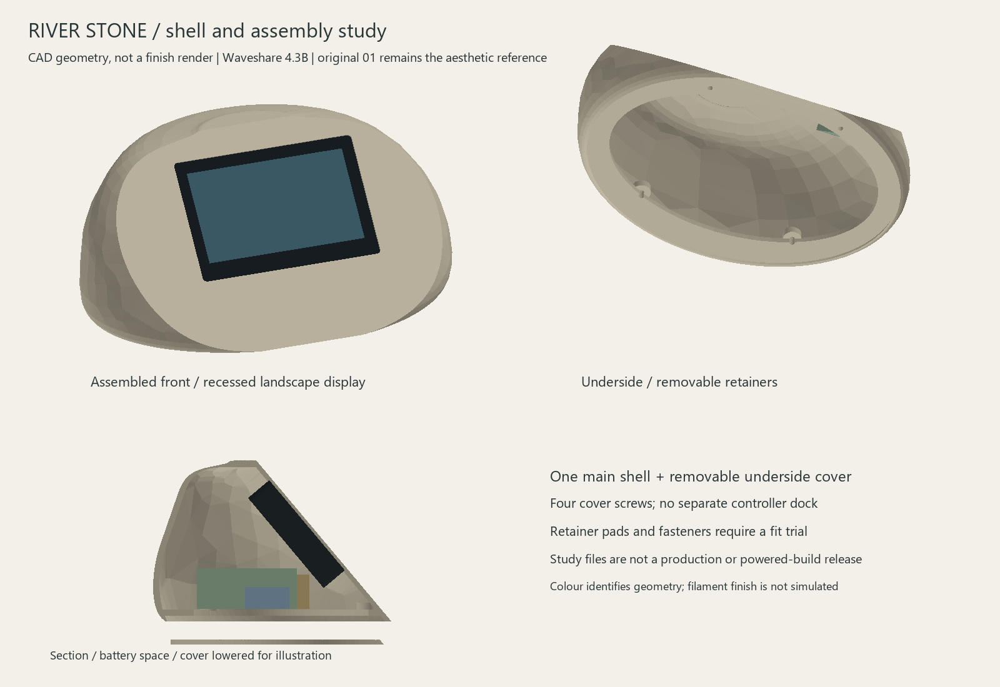

# River Stone screen-retention study v2

21 September 2026. Original 01 River Stone, stationary, Waveshare ESP32-S3-Touch-LCD-4.3B without case. **Engineering study; complete housing not released for printing.**



This revision adds two removable internal side retainers and four mounting bosses to the [v1 shell](../shell-v1/README.md). The exterior, screen angle and battery/power reservations remain as in v1. An attempted 6 mm screen-facet fillet passed CAD solid validity but exported open meshes, including at finer tessellation. It was removed from the delivered model. The soft transition toward the original concept remains unresolved.

## Retention proposal

Each retainer has a 47 mm long contact rail and two screw holes. Four provisional M3-size screws secure the pair to shell bosses, with 3.4 mm clearance holes and 5.8 mm across-flats nut pockets. Remove the retainers before inserting the display vertically through the empty underside, then install them before power parts. The continuous insertion sweep includes the fixed bosses and excludes the removable retainers.

The intended compliant pads sit between rails and rear lens margins. The model leaves 0.6 mm at the nominal glass rear face, provisionally accommodating a 0.8 mm pad compressed by 0.2 mm. This is a geometry proposal, not a validated glass clamp: pad stiffness, tolerances, contact surfaces, screw length and loading require physical validation. The retainer geometry clears a 105 mm wide PCB proxy by 0.3 mm on each side. It has **not** been checked against all details of the supplier STEP or actual board. Do not tighten these parts onto a display based on this study alone.

## Files and fit samples

- [Assembly STEP](assembly-envelopes.step): shell, cover, display and power envelopes, and two retainers.
- [Shell STEP](shell-study.step), [left retainer](retainer-left.step), [right retainer](retainer-right.step); corresponding STL files use assembly coordinates.
- [Mount coupon STL](retainer-mount-coupon.stl): 19 x 24 x 10 mm trial of the boss, nut pocket and screw passage.
- [Retainer coupon STL](retainer-strip-coupon.stl): 15.2 x 16 x 9.4 mm rail/plate and clearance-hole trial.
- [Geometry checks](validation.json), [mesh checks](mesh-validation.json), [wall/overhang audit](print-audit.json).

The two coupons are supplied with broad flat faces at Z=0. Inspect them in the P1S slicer using the intended material and 0.4 mm nozzle before printing. Test actual nut insertion, screw alignment and repeatable removal without glass; record material, layer height and measured fit. They do not reproduce the full enclosure or validate its strength. No slicer run or physical print has occurred. The full retainers need orientation in the slicer; their exported coordinates are for assembly, not bed placement.

## Verified and unresolved

All seven exported STL meshes are watertight, consistently wound, positive-volume single components within a 256 mm cube. Approximate shell mesh bounds are 220.1 x 152.4 x 103 mm. CAD checks found no overlaps between the shell, seated display envelope, cover and component reservations. Retainers clear the shell, glass proxy, PCB proxy and power reservations. The conservative continuous display insertion path is clear with retainers removed. These checks do not include connected plugs or wires.

A seeded, area-weighted audit sampled 2,048 face-centre inward normal rays; all found exits. The smallest sampled directional material depth was **0.764 mm**, on the bottom rim. Another sample near the crown was **0.938 mm**. The deliberate front lip is 1 mm. Edge rays can measure short wedges; this is not a certified global minimum wall thickness. Local rim/crown sections need refinement and more detailed checking before a full print.

A 45-degree face-normal screen found approximately 14,874 mm2 of downward overhang area with the underside down, versus 3,950 mm2 with the screen facet down, excluding bed-contact triangles. These are geometric area measurements, not support estimates or slicer approval. Facet-down would place a visible surface on the bed; orientation must consider surface quality as well as support removal. A support-free claim is not justified.

Next work: reinforce/check local walls, resolve the front transition without invalid surfaces, check retainers against actual board details, slice fit samples, then resolve connector access, battery restraint, microphone/antenna space and power parts. Preserve minimal finishing and the original pebble aesthetic throughout.

## Reproduce

Use CadQuery 2.8.0 for solids; numpy/Pillow for preview; trimesh plus scipy/networkx for mesh checks. Optional `--deps PATH` is supported by the CAD, mesh and audit tools.

```text
python tools/river_stone_shell.py --revision v2
python tools/render_river_stone.py --revision v2
python tools/check_river_stone_meshes.py --revision v2
python tools/audit_river_stone_print.py
```

The supplier reference is documented and illustrated in v1; this run uses its conservative envelope. Generated `preview-meshes.json` is ignored. The original v1 files remain historical evidence.
