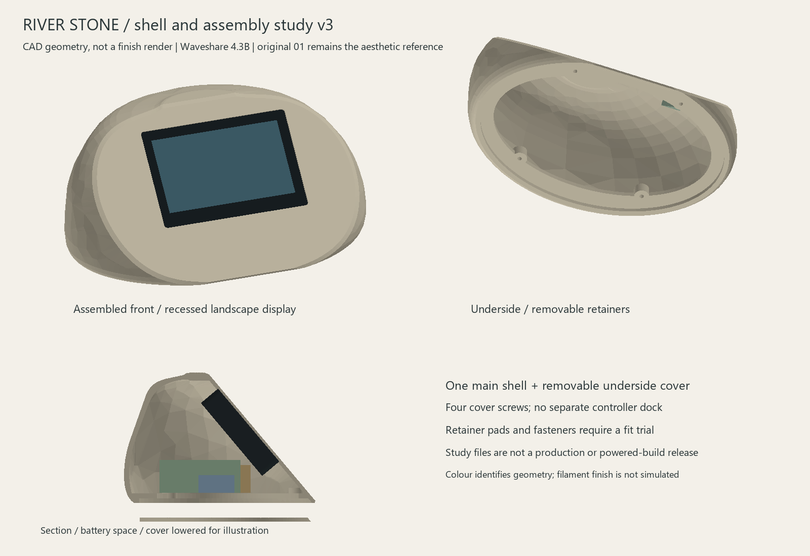

# River Stone reinforced-shell study v3

> **PARKED FALLBACK — 25 September 2026 (D030).** This is Waveshare-specific work, preserved without changing its geometry/results. Active design is [iPhone 11 mounting](../iphone-mount/README.md); old printing/next-step instructions below are suspended. See [fallback status](../fallback-waveshare.md).

21 September 2026. Dedicated Waveshare 4.3B without case, stationary original 01 River Stone. **CAD study, not a complete print or powered-build release.**



The lower rim is reinforced internally over its first 3.5 mm. Cover screw bosses now extend down to the ledge base at Z=3.5 mm, strengthening the junction beside their holes. The two upper cavity rings are lowered by 3 mm and its closing cap by 2 mm to add material beneath the crown. A 2 mm bevel now breaks the perimeter of the screen facet. This is a narrow chamfer, not the broad soft blend attempted in v2; further aesthetic refinement may still be needed against the original reference.

The shell remains approximately 220.1 x 151.1 x 103 mm. The matching underside cover is now 199.4 x 135.4 x 3 mm, reduced to clear the reinforced rim. Use the v3 cover with the v3 shell. The four cover fasteners, 50-degree display angle, side retainers and battery/power reservations retain their previous positions. The added shell material increases enclosed solid volume from about 206.3 to 229.8 cm3; this is not a slicer filament-volume estimate.

## Files

- [Shell STEP](shell-study.step) and [STL](shell-study.stl).
- [Matching cover STEP](cover-study.step) and [STL](cover-study.stl).
- [Assembly STEP](assembly-envelopes.step): includes retainers and conservative display/power envelopes.
- [Geometry validation](validation.json), [mesh validation](mesh-validation.json) and [print audit](print-audit.json).
- [Mount coupon](retainer-mount-coupon.stl) and [retainer coupon](retainer-strip-coupon.stl): unchanged from v2. See [fit-trial procedure and retention limitations](../shell-v2/README.md).

Seven exported meshes pass watertightness, consistent winding, positive volume, single-component and 256 mm cube checks. The fixed bosses and reinforced shell still clear the continuous conservative display-insertion path with retainers removed. Seated display, cover, glass/PCB proxies and component reservations pass the applicable collision checks. Actual cables, connector details and glass contact/load are not proven.

## Print audit

A seeded audit of 10,000 area-weighted face-centre rays found an exit for every ray. Minimum sampled depth is approximately **1.000 mm**, at the intentional screen lip. No samples are below 1 mm using a 0.0001 mm numerical tolerance. The first percentile is 2.065 mm, fifth percentile 3.000 mm and median 3.912 mm. This removes the sub-1 mm findings from the delivered audit; it does not prove that every possible section exceeds that value.

An intermediate v3 check located a 0.746 mm junction beside a rear cover screw hole. Extending the cover bosses through the ledge resolved that sampled issue. The final report contains the hash of the checked STL, matching the mesh-validation report.

Downward surface area beyond the 45-degree criterion is approximately **13,795 mm2 underside-down** and **5,328 mm2 screen-facet-down**, excluding bed-contact triangles. Reinforcement has not made the shell support-free.

The audit samples inward normal rays from mesh face centres. It cannot certify the global minimum wall thickness or print strength. Overhang areas classify triangle normals; they are not support-volume or slicer predictions. The visible face would touch the bed in the facet-down orientation, so lower overhang area alone does not establish the best print orientation. The preview uses coarse flat triangle shading; that appearance is not the intended filament texture.

Full-shell slicing, retention fit against the actual board, gasket loading, battery restraint, connectors, microphone/antenna space and electrical integration remain open. First inspect and slice the small fit coupons on the P1S with the intended filament and 0.4 mm nozzle. No slicing or physical testing was performed in this revision.

## Regeneration

Dependencies: CadQuery 2.8.0; numpy/Pillow for rendering; trimesh with scipy/networkx for checks. The CAD, mesh and audit commands accept `--deps PATH` for a local dependency directory.

```text
python tools/river_stone_shell.py --revision v3
python tools/render_river_stone.py --revision v3
python tools/check_river_stone_meshes.py --revision v3
python tools/audit_river_stone_print.py --revision v3 --samples 10000
```

The generator preserves explicit v1/v2 options; v3 is the new default. Earlier revision artifacts remain unchanged except for documentation that makes regeneration versions explicit.
