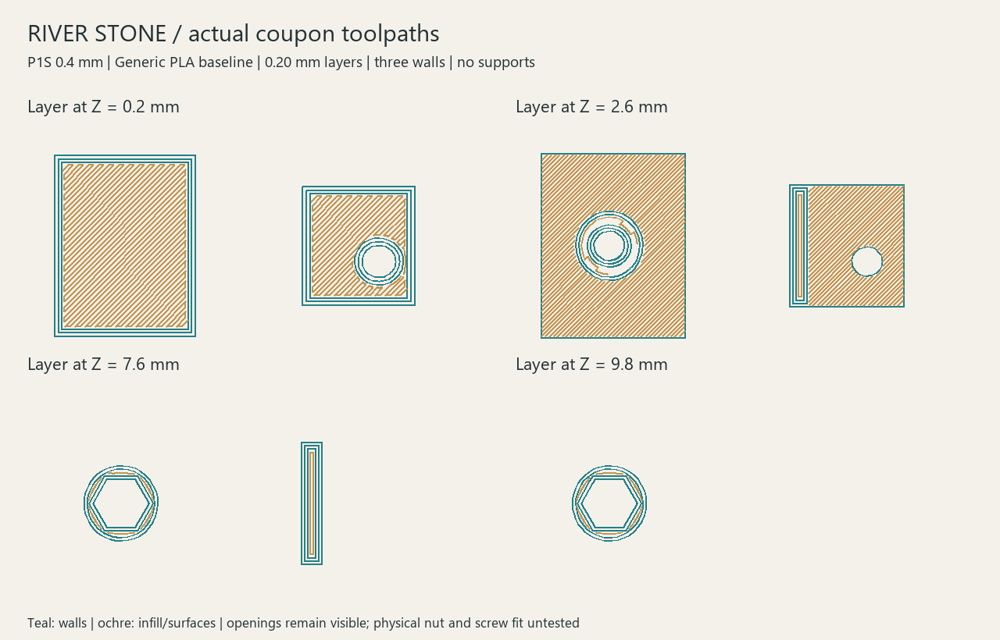

# River Stone P1S slicing study and fit trial

> **PARKED FALLBACK — 25 September 2026 (D030).** This is Waveshare-specific work, preserved without changing its geometry/results. Active design is [iPhone 11 mounting](../iphone-mount/README.md); old printing/next-step instructions below are suspended. See [fallback status](../fallback-waveshare.md).

21 September 2026. Based on [shell v3](../shell-v3/README.md), dedicated Waveshare 4.3B and stationary original River Stone. Offline slicing completed; no printer connection, print, or physical fit test occurred.

## Small fit trial

Open [fit-coupons.3mf](fit-coupons.3mf) in OrcaSlicer to review the two sample parts and their generated toolpaths. [Combined STL](fit-coupons.stl) is also included for your preferred slicer. The source samples are unchanged v3 geometry, arranged with broad flat faces down. The combined STL contains two disconnected parts intentionally.



The 3MF uses **P1S, 0.4 mm nozzle, Generic PLA, textured PEI, 0.20 mm layers, three walls and 15% infill, no supports or brim**. The inherited profile sets a 220 C nozzle and 55 C bed. Generic PLA and the plate are provisional assumptions for this study; check the actual spool and installed plate before printing or re-slicing. This is not a selected enclosure material or finish.

Slicer estimate: **15 minutes 49 seconds total, 2.73 g PLA**, 50 layers. Startup contributes approximately 6 minutes 16 seconds to that estimate. The coupon plate is within the P1S bed; exported metadata reports no outside-bed placement and no support use. Selected actual toolpaths were inspected at Z=0.2, 2.6, 7.6 and 9.8 mm. The screw passage and upper hex nut pocket remain open where intended. The mount coupon's bed-facing panel is intentionally blind, like its enclosure attachment face. Toolpath viewing does not establish dimensional fit.

All three slices retain Orca's `bed_temperature_too_high_than_filament` warning (1000C001, level 3). It occurred with the inherited Generic PLA/55 C textured-plate profile. This is recorded rather than hidden or described as a warning-free pass. Review the warning in the slicer against your actual filament and enclosure setup before printing. No temperature adjustment was validated physically.

After the small print, check that the intended nut seats without splitting the boss, the screw passes through the retainer coupon freely, and the pair can be tightened and removed by hand without stripping or bottoming. Record actual hardware dimensions, filament, plate, layer height and measured hole/nut fit. Keep glass out of this trial; the pads and actual Waveshare contact still require validation. A successful coupon does not release the full shell.

## Shell orientation comparison

Both orientations slice successfully with the same provisional PLA/P1S profiles and normal automatic supports permitted on the model as well as the bed. The shell profile keeps the no-brim baseline. These are baseline estimates, not optimized support settings or a final print orientation.

| Orientation | Estimated total time | Slicer filament estimate | Commanded support volume |
|---|---:|---:|---:|
| Underside down | 7h 43m 59s | 289.08 g | 74.44 cm3 |
| Screen facet down | 6h 18m 02s | 224.85 g | 21.84 cm3 |

Facet-down reduces the estimate by about 1h 26m and 64 g, but the visible front face contacts textured PEI and the bevel/shoulders still need support review. Underside-down keeps that broad visible face off the bed but uses much more support, including support in the hollow body. Removal access and marks remain physical questions. The two orientations therefore stay open until a surface sample establishes which leaves an acceptable result with little finishing.

Support volume is calculated from positive extrusion commands on XY/arc moves tagged as support or support interface, using the declared 1.75 mm filament diameter. It excludes Custom startup/purge moves and is not measured consumption. Total filament and time are Orca estimates. Independent support layers account for layer counts that can exceed height divided by 0.20 mm. Successful slicing does not prove support removability, print stability, strength, glass loading or finish quality.

The prepared orientation STLs and result summaries are retained here. Full-shell sliced projects/G-code remain in ignored local work folders; the full housing remains **not released for printing**.

## Reproducibility and sources

- [OrcaSlicer 2.4.2 official release](https://github.com/OrcaSlicer/OrcaSlicer/releases/tag/v2.4.2), Windows x64 portable archive; its checksum is in [source.json](source.json).
- [Official CLI documentation](https://github.com/OrcaSlicer/OrcaSlicer/wiki/cli_mode).
- Flattened profiles derive from Orca's bundled BBL profiles: `Bambu Lab P1S 0.4 nozzle`, its compatible `0.20mm Standard @BBL X1C`, and `Generic PLA`. Inheritance is resolved before the documented overrides. The profile names identify their base; the process settings are modified as listed above. The bundled [AGPLv3 license](profiles-LICENSE.txt) is retained for this third-party material. The slicer binary is not committed.
- [Coupon result](fit-coupons-result.json), [underside-down result](shell-underside-down-result.json), [facet-down result](shell-facet-down-result.json), [toolpath and warning review](toolpath-review.json). Hashes tie each result to its geometry, profiles and local G-code.

Run from repository root with Python, trimesh/numpy and Pillow installed:

```text
python tools/prepare_river_stone_slice.py --slicer-zip PATH_TO_OFFICIAL_PORTABLE_ZIP
python tools/slice_river_stone.py --slicer PATH_TO_ORCA_EXE --job fit-coupons
python tools/slice_river_stone.py --slicer PATH_TO_ORCA_EXE --job shell-underside-down
python tools/slice_river_stone.py --slicer PATH_TO_ORCA_EXE --job shell-facet-down
python tools/review_river_stone_toolpaths.py
```

Preparation accepts `--deps PATH` for the local trimesh installation. Slicing runs without a visible window and writes no commands to a printer. G-code timestamps mean a regenerated checksum may differ even when the settings and geometry match.
